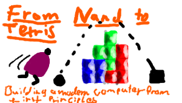

<div id="top"></div>

[![OS-Windows]][OS-Windows]
[![OS-Linux]][OS-Linux]
[![OS-MacOS]][OS-MacOS]

<br/>
<div align="center">
<h2 align="center"><b>Nand2Tetris Course</b></h2>
   <p align="center">
      
   </p>
   <p align="center">
      The full implementation of the <a href="https://www.nand2tetris.org/course">Nand2Tetris</a> course provided by Shimon Schocken and Noam Nisan
   </p>
</div>

<details>
   <summary>Table of Contents</summary>
   <ol>
      <li>
         <a href="#getting-started">Getting Started</a>
         <ul>
            <li><a href="#prerequisites">Prerequisites</a></li>
         </ul>
      </li>
      <li><a href="#projects">Projects</a></li>
      <li><a href="#contact">Contact</a></li>
   </ol>
</details>

## Getting Started

```console
Most Projects were developed with the following Version Specifications:

Python:
Python 3.13.5 (tags/v3.13.5:6cb20a2, Jun 11 2025, 16:15:46) [MSC v.1943 64 bit (AMD64)]

(Tested with Versions 3.12, 3.11, 3.10, 3.9, 3.8, 3.7 and 3.6)
```

### Prerequisites

- Download & Install Python (>= v.3.6):
    - [Python](https://www.python.org/downloads/)

## Projects

> [Project 1 : Boolean Logic](https://github.com/SilenZcience/NandToTetris/tree/main/projects/1)

> [Project 2 : Boolean Arithmetic](https://github.com/SilenZcience/NandToTetris/tree/main/projects/2)

> [Project 3 : Memory](https://github.com/SilenZcience/NandToTetris/tree/main/projects/3)

> [Project 4 : Machine Language](https://github.com/SilenZcience/NandToTetris/tree/main/projects/4)

> [Project 5 : Computer Architecture](https://github.com/SilenZcience/NandToTetris/tree/main/projects/5)

> [Project 6 : Assembler](https://github.com/SilenZcience/NandToTetris/tree/main/projects/6)

> [Project 7 : VM I : Stack Arithemtic](https://github.com/SilenZcience/NandToTetris/tree/main/projects/7)

> [Project 8 : VM II: Program Control](https://github.com/SilenZcience/NandToTetris/tree/main/projects/8)

> [Project 9 : High-Level Language](https://github.com/SilenZcience/NandToTetris/tree/main/projects/9)

> [Project 10: Compiler I : Syntax Analysis](https://github.com/SilenZcience/NandToTetris/tree/main/projects/10)

> [Project 11: Compiler II: Code Generation](https://github.com/SilenZcience/NandToTetris/tree/main/projects/11)

> [Project 12: Operating System](https://github.com/SilenZcience/NandToTetris/tree/main/projects/12)


<p align="right">(<a href="#top">back to top</a>)</p>

## Contact

> **SilenZcience** <br/>
[![GitHub-SilenZcience][GitHub-SilenZcience]](https://github.com/SilenZcience)

[GitHub-SilenZcience]: https://img.shields.io/badge/GitHub-SilenZcience-orange

[OS-Windows]: https://img.shields.io/badge/os-windows-green
[OS-Linux]: https://img.shields.io/badge/os-linux-green
[OS-MacOS]: https://img.shields.io/badge/os-macOS-green
